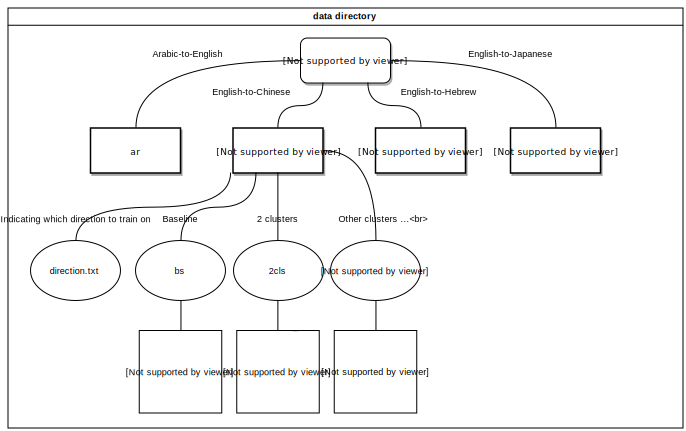

# Transliteration
This is a summer project regarding to the problem set of multi-lingual transliteration. <br />
The project is initialized and supervised by Shay Cohen and Joana Ribeiro from the NLP group of the University of Edinburgh.<br />
The details of this project is in the 
[report file](https://docs.google.com/document/d/1XQTABQMb8yKXFJmztmp0CIdFN2FmdXLmDAEXUzzUbMI/edit?usp=sharing)<br />

---

# Experiment 

### Setup

##### 1. Download a usable Anaconda:

```bash
wget https://repo.continuum.io/miniconda/Miniconda2-latest-Linux-x86_64.sh
```

##### 2. Bash it and remember to store it in somewhere with enough space (e.g. /disk/ocean)

##### 3. Create conda environment, save the PATH, and activate:

```bash
conda create -n pytorch python=2.7
source ~/.bashrc
source activate pytorch
```

##### 4. Install Pytorch with CUDA-9:

```bash
conda install pytorch torchvision cuda91 -c pytorch
```

##### 5. Install openNMT-py and its dependency:

```bash
git clone https://github.com/OpenNMT/OpenNMT-py
cd OpenNMT-py
pip install -r requirements.txt
```
##### 6. Create a python3 virtual environment and install the [script](https://github.com/belambert/asr-evaluation) for checking character error rate. If you want to use the scripts in the Data Clustering section, you also need to install scikit-learn package.
---
### Data Clustering
#### Prerequisites: 
1. Source language data files: src_tra.txt, src_dev.txt, src_tst.txt
2. Target language data files: tgt_tra.txt, tgt_dev.txt, tgt_tst.txt
3. Format: One word per line, characters are separated by a space.
```bash
# e.g.
head -5 ch_tra.txt
古 尔 蒂
惠 特 里 奇
珀 西 亚 塞 普
霍 利 菲 尔 德
哈 纳 汉
```
#### Feature vecotrs:
- Script:
```
feature_vector/feature_vector.py
```
- Function: 
```
Generate all the feature vecotors based on the training data's features, store them in a csr matrix.
```
- Required: 
```
A directory named bs that stores the formatted data files: 
    src_tra.txt, src_dev.txt, src_tst.txt, tgt_tra.txt, tgt_dev.txt, tgt_tst.txt
```
- Usage:
```bash
# args = {src_language src_features_type tgt_language tgt_features_type}
# src/tgt_features_type choices: {
#        "L": [L_unigram], "R": [R_unigram],
#        "LR": [L_unigram ; R_unigram],
#        "bLR": [LR_bigram],
#        "LRbLR": [L_unigram ; R_unigram ; LR_bigram]
#        "LL": [L_alt_unigram, L_unigram]
#        "RR": [R_unigram, R_alt_unigram]
#        "LLR": LL + R
#        "RRL": RR + L
#        "LLRRLR": LL + RR + LR
#        }
# additional IPA features: for Chinese data only.
# e.g.
python feature_vector.py en LR ch LR 
Please enter the directory where the required fvs files and original data files exist
---> data/ch/bs
```
Note: If you want to add more features, let me know or you can directly modify the code. <br />

#### Clustering: 

- Script：
```
feature_vecotr/clustering.py
```
- Function: 
```
Apply clustering on the training dataset, then predict clustering of the development and test dataset
```
- Required: 
```
a directory, say fvs_ch, that stores all the npt files generated from feature_vector.py, 
along with the original data files.
```
- Usage:
```bash
# args = {src_language tgt_language algorithm clusters(optional)}
# algorithm choices: {k-means} --- only k-means for now
# clusters could be a sequence of intergers >= 2. DEFAULT: 2 5 10 15
# e.g. 
python clustering.py en ch k-means 2 4 5 7 9 10 12 15
Please enter the directory where the required fvs files and original data files exist
---> fvs_ch
```
As a result, we now have all the data files needed for training.
```
# e.g.
en_tra_2cls.txt
ch_tra_2cls.txt
en_dev_2cls.txt
ch_dev_2cls.txt
en_tst_2cls.txt
ch_tst_2cls.txt
...
```
If you want to use the scripts described below, move your data to the corresponding directory as shown in the diagram.

---
### Using convenient scripts in NMT-py/scripts
#### Prerequisites: 
 1. Main Directory: (You can change the value of main_dir in the bash scripts) <br />
 ```bash
 main_dir=/disk/ocean/lhe/transliteration/nmt-py 
 ```
 2. OpenNMT-py in the Main Directory: <br />
 ```bash
 main_dir/OpenNMT-py
 ```
 3. Data Directory: <br />
 ```bash
 main_dir/data 
 ```
 <br />
 4. Virtual Environment (pytorch) for pytorch-0.4, CUDA 9, python2 <br />
 5. Virtual Environment (venv-py3) for python3 which installs the script [here](https://github.com/belambert/asr-evaluation)<br />
 6. Archive everything (This is optional, after each experiment is finished, move the directories: data, models, and best_results in it)
 ```bash
 main_dir/archive
 ```
#### Include:
 1. ez_training_script (In pytorch env)
 2. all_in (In pytorch env)
 3. infer_scripts/test_script (In pytorch env)
 4. infer_scripts/err (In venv-py3 env)
 5. infer_scripts/wer.py (In venv-py3 env)
 6. infer_scripts/cer.py (In venv-py3 env)
 7. infer_scripts/bst_ckp.py (In venv-py3 env)
 8. infer_scripts/rst (In venv-py3 env)

#### Usage:
 1. ez_training_script 
```bash
# args = {$lan(language), $ann(annotation), $t_steps(training_steps), $lr(learning_rate), $e_type(encoder_type), $src(source language), $tgt(target language), a sequence of $cluster_number}
# activate pytorch
# A script that serializes the whole process including proprocess.py train.py and translate.py 
# for a single annotation of one language 
# $lan: the name of data directory, e.g. ch means all the Chinese data are stored in data/ch
# $ann choices: {bs -+ +- ++} 
bash ez_training_script ch +- 15000 0.8 brnn en ch 2 5 10 15
```
 2. all_in
 ```bash
 # A script that takes ez_training_script into a for-loop
 # activate pytorch
 bash all_in ch en ch # The first argument is always the name of the sub-directory of data, e.g. data/ch
 ```
 3. err
 ```bash
 # args = {$lan, $src, $tgt, $t_steps(training_steps), $cls(current cluster number or bs)}
 # activate venv-py3
 # The ez_training_script will copy err, wer.py, cer.py to 
 # $main_dir/models/$lan/bs/infer and $main_dir/models/$lan/$ann/$cls/infer
 # cd to each directory after the whole training is down
 # e.g.
 main_dir=/disk/ocean/lhe/transliteration/nmt-py
 cd $main_dir/models/ch/bs
 bash err ch en ch 15000 bs
 Best checkpoint: 15000
 WER: 0.29841
 CER: 0.12239
 cat wer.txt # to see all the WER results
 cat cer-clean.txt # to see all the CER results
 # e.g.
 main_dir=/disk/ocean/lhe/transliteration/nmt-py
 cd $main_dir/models/ch/m+-/2
 bash err ch en ch 15000 2
 # Results printed
 Best checkpoint: 15000
 WER: 0.29841
 CER: 0.12239
 cat wer.txt # to see all the WER results
 cat cer-clean.txt # to see all the CER results
 ```
 4. test_script
 ```bash
 # args = {$lan, $src, $tgt, a sequence of $cls (no need for bs))
 # A script that generates the predictions files for the test dataset using the best checkpoints 
 # You need to input the best checkpoints
 # activate pytorch
 # e.g.
 bash test_script ch en ch 2 5 10 15
 ...
 Best checkpoint_step for bs:
 12000 # If baseline results has been generated in the previous experiment, put -1 here
 Best checkpoint_setps in m-+ are:
 For cluster 2
 12000
 For cluster 5
 12000
 For cluster 10
 12000
 For cluster 12
 12000
 ... # Generating test files for all the clusters in m-+ using the input checkpoints
 Best checkpoint_setps in m+- are:
 ... # Same
 Best checkpoint_setps in m++ are:
 ... # Same
 ALL FINISH!
 ```
 Note: If you want to only test one of the +-, -+, ++, please modify the value of ann in the script. <br />
 5. rst 
 ```bash
 # After test_script finishes its job, cd to the infer directory of each model, use this script to see the test results
 # args = {$lan $tgt $ann $cls)
 # $lan specifies the name of directory storing the corresponding data, it is usually $lan vs. en
 # $tgt means target language
 # $ann from {m-+ m+- m++ bs}, it is for coping the results to the corresponding sub-directories of best_results
 # $cls: just cluster number
 bash rst ch ch m+- 2
 ```
 

---
### Individual Commands

##### - Preprocess:

```bash
python PATH_FOR_OpenNMT/OpenNMT-py/preprocess.py
-train_src data/en_tra.txt
-train_tgt data/ch_tra.txt
-valid_src data/en_dev.txt
-valid_tgt data/ch_dev.txt
-save_data data/DEMO # suggested naming: bs(baseline) or {2 4 5 7 9 10 12 15}(cluster number)
```

##### - Training:
(Assume: cur_directory=/disk/ocean/lhe/en2chi/nmt-py/models/bs)

```bash
python PATH_FOR_OpenNMT/OpenNMT-py/train.py
-data data/DEMO # Any name generated from the preprocessing
-save_model MODEL # suggested naming: bs(baseline) or {2 4 5 7 9 10 12 15}(cluster number)
-train_steps 15000 
-seed 7
-start_decay_step 8000
-save_checkpoint_steps 100
-keep_checkpoint 10
-decay_steps 1000
-learning_rate 0.8
-encoder_type brnn # the decoder type only has rnn
-gpuid 1
-log_file logs/DEMO.log # Save the training details
```

##### - Translate:

```bash
for i in {checkpoint_start_NUMBER..checkpoint_end_NUMBER..checkpoint_save_STEPS}
do
python PATH_FOR_OpenNMT/OpenNMT-py/translate.py
-model bs_step_$i.pt
-src data/en_dev.txt
-output infer/bs_dev_$i.txt
-replace_unk
-verbose
-gpu 1
done
```
##### - check WER: 
(nmt-py/scripts/infer_scripts/wer.py)
```bash
# (In python3 venv)
for i in {checkpoint_start_NUMBER..checkpoint_end_NUMBER..checkpoint_save_STEPS}; 
do 
   python wer.py bs_dev_$i.txt ch_dev.txt; 
   echo $i; 
done
```
##### - check CER:
Use the script [here](https://github.com/belambert/asr-evaluation)
And do similar for-loop as above.

### Citation
- OpenNMT-py:<br />
   https://github.com/OpenNMT/OpenNMT-py
